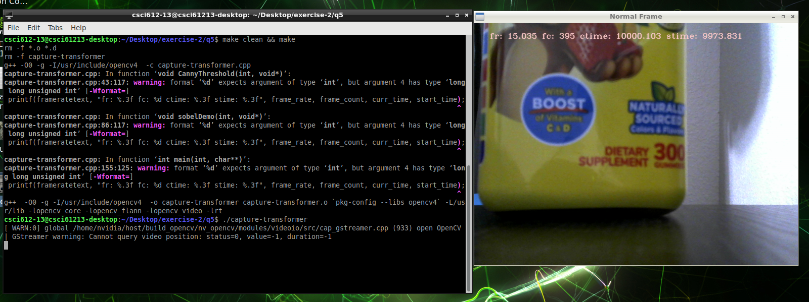

# Edge Detection with OpenCV

The project aimed to develop a real-time viewer utilizing OpenCV and a USB webcam, allowing users to toggle between different edge detection techniques (Canny and Sobel) using keystrokes ("c" for Canny, "s" for Sobel, "n" for None). 

Implemented functionalities included:
- Integration of OpenCV camera capture code with edge detection algorithms for Canny and Sobel.
- Keystroke-based control to activate/deactivate edge detection techniques.
- Optional sliders for adjusting threshold parameters in Canny and Sobel algorithms (not mandatory).
- Calculation of average frame rate for each edge detection technique using posix_clock_gettime time stamping.

Overall, the project provided users with a flexible interface to visualize real-time webcam footage and explore different edge detection techniques, with performance metrics provided for each method.

**Canny Enabled with slider to adjust min threshold, along with build and run showing fps as 'fr':**
---

**Normal preview, along with build and run showing fps as 'fr':**
---

**Sobel Enabled with sliders to adjust thresholds, along with build and run showing fps as 'fr':**
---

